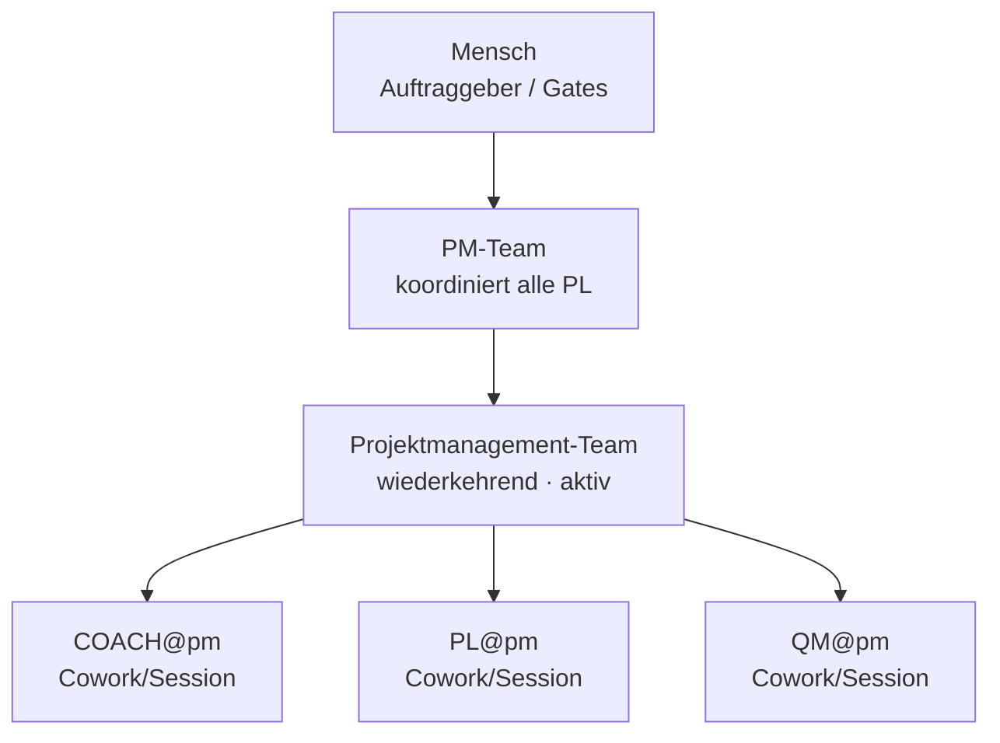

# Organigramm: Projektmanagement-Team

*Generiert aus den Registries (`process/teams/registry.yaml`, `process/roles/besetzungen.yaml`) durch `platform/scripts/organigramm.py` — **nicht von Hand pflegen**, Änderungen gehören in die Registry (Konzept `process/docs/03-rollenmodell-v2-orga-rework.md` Kap. 8).*

**Auftrag:** Projektmanagement-Team: Intake, Staffing, Session-Agenda, Koordination, LeLe (festes Team)

## Beteiligte

| Instanz | Rolle | Motor | Takt | Status | Quelle | Hinweis |
|---|---|---|---|---|---|---|
| COACH@pm | Prozess-Coach | Cowork/Session | sprint | aktiv | explizit | LeLe-Register über alle Projekte; kuratiert Wissensbasen (Lernzyklus) |
| PL@pm | Projektleiter | Cowork/Session | sprint | aktiv | explizit | Koordiniert alle PL-Instanzen (Session-Agenda, Prioritäten, Besetzungen) |
| QM@pm | Qualitätsmanager | Cowork/Session | sprint | aktiv | explizit | — |

Rollen-Bauplan: `process/roles/<rolle>.md` · projektspezifischer Teil: `roles/<rolle>.md` in diesem Repo · Historie: `docs/historie.md`
